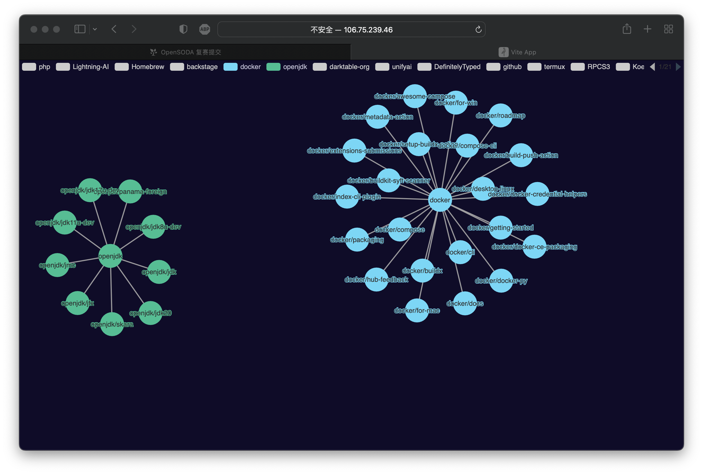
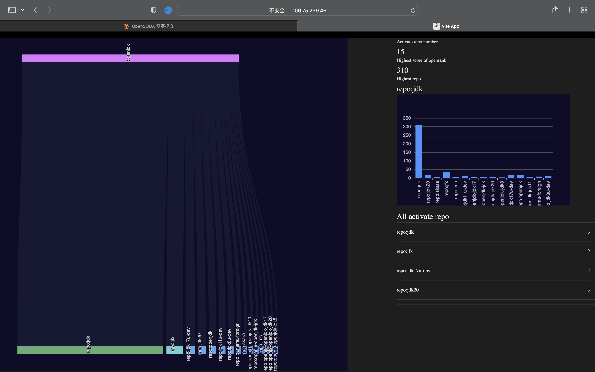
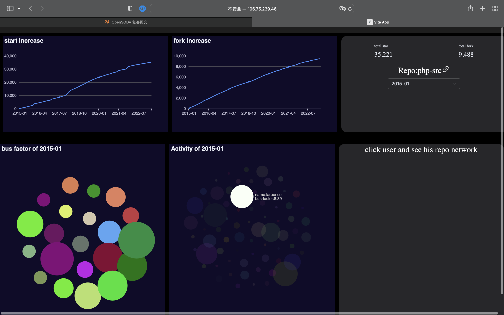
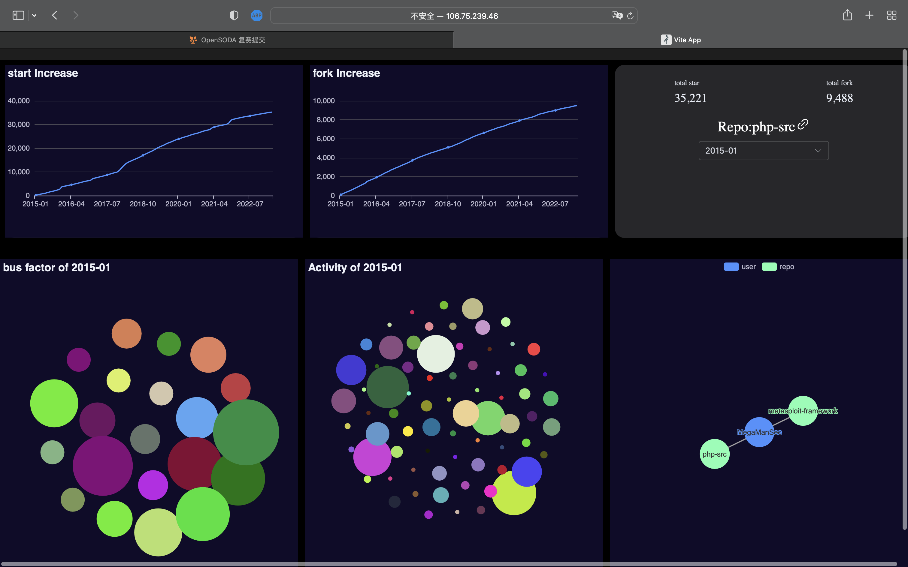

## 开源学习作品报告

在线预览：[链接](http://106.75.239.46:5174) **服务器带宽有限，初次加载可能有点慢**

B站视频：[链接](https://www.bilibili.com/video/BV1JV4y1b7nM/?share_source=copy_web&vd_source=60573de84ad2af78ce8acc6c7ab219c8)
> 小组成员
> 庄志豪 52155903033
> 王赫 51255903031
> 陈鹏 51255903092
> 张布昂 51255903073
>
> 

[TOC]


##  引言

在$GitHub$中，开源协作从单纯的Git代码协作扩大为基于Issue、PR、Discussion、Follow等$GitHub$特性的多维协作。协作建立联系，联系构造网络。例如，基于开发者之间和开发者对项目、组织的Follow情况可以构造Follow网络；基于 Comment中的@和#可以构造引用网络等。

通过构造网络、分析网络并可视化网络的方式展现开源协作数据，开源世界将更好地被人们洞察。

## 任务目的

​	本项目的任务目标是利用项目内的协作网络数据构建一个具有美学价值和实用价值的网络可视化应用。通过分析和可视化协作网络，我们旨在揭示公司之间，仓库之间，和仓库内的数据模式与关联以及相关的洞察和趋势。具体而言，我们将会提供三个视角去洞察开源。
1. 首先是开发者与开发者之间，我们会提供可视化面板方便的让用户查看不同开发者之间的项目。比如比较google和alibaba两家公司在GitHub公司上的开源信息等。
2. 提供开发者内部的仓库对比，我们会提供可视化面板，让用户查看到开发者所开源的每个项目之间的活跃值等等相关数据。
3. 我们会提供单个项目的内的相关数据可视化，包括成员贡献、项目star、fork等相关数据。同时我们还可以基于用户视角查看其所贡献的仓库。

> 上述三个视角从大到小，可以方便用户对开源公司、项目、人员等相关数据进行洞察。
> 
我们的任务目标包括：

- 构建仓库，开发者等相关网络：

  - 基于项目内的协作网络数据，使用合适的网络构建方法创建一个开源网络表示。

  - 考虑使用适当的权重或边属性来表示开发者的活跃值或其他相关信息。


- 可视化应用开发：

  - 开发一个美观、直观的网络可视化应用程序，使用户能够交互式地探索和分析协作网络。
  - 提供用户友好的界面，包括导航、筛选、聚焦和定制功能，以便用户可以根据自己的兴趣和需求自定义视图和分析。
  - 利用视觉元素、颜色编码、布局等设计手段，凸显网络的重要特征、关键节点和群体结构。

- 结果解释和应用：

  - 解释和呈现协作网络的主要发现、洞察和趋势。
  - 分析开发者之间的合作模式、项目内的协作结构以及与项目成功相关的关键因素。
  - 探索协作网络的实用价值，例如用于团队合作管理、项目管理、人才发现等方面的潜在应用。

  通过达到以上任务目标，我们希望能够提供一个全面而直观的协作网络可视化应用，帮助用户洞察和分析开源项目。

## 数据准备

​	由赛方提供的项目的协作网络数据，以月为维度发布，目前支持了阿里开源开发者贡献榜、$XSOSI$项目等共计73个仓库的数据。其中数据类型包含节点和边。

- 节点数据（nodes）包括以下字段：
  - id:  节点的唯一标识。
  - n: 节点名， 包括仓库、开发者、Issue、PR编号的信息。
  - c:  节点类型， 表示结点是仓库$(r)$、开发者$(u)$、Issue$(i)$  还是PR（p) 。
  - v：当月的$OpenRank$值，用于衡量节点的活跃程度。

- 边数据（links）包括以下字段：
  - s：边的起点，指向边的源节点。
  - t：边的终点，指向边的目标节点。
  - w：边的权重，表示边的强度或其他相关属性。


在基于上述数据的同时我们需要对数据进行一定的处理，在给出的仓库里筛选出相同用户其所贡献的所有仓库。
如下所示
```json
{
  "user":[
    {"repo":"name","value":1,"date":"2020-01-10"}
  ]

}

```

## 数据可视化网络

### 数据可视化过程

- 首页是一个展示许多项目的页面，这些项目包括$PHP$、$Homebrew$和$Openjdk$等。当你进入首页时，你会看到各种项目的列表。为了更方便地了解每个项目，你可以点击你感兴趣的项目，这将会展示一个关于该项目的可视化关联图，如图1所示。在这个关联图中，项目被放置在中间节点，而与项目相关的$GitHub$仓库则以其他节点的形式呈现。
  

- 当你点击项目的中间节点时，你将会跳转到一个关于该项目的介绍页面，就像图2所展示的那样。在这个页面的左侧，你可以看到一个可视化图，它显示了$Homebrew$项目中各个仓库所占比重的排序情况。这些排序是根据计算得到的$openrank$值进行的。右侧的部分显示了与该项目相关的活跃仓库数量，以及最高仓库的$openrank$值和仓库名称。
  

- 在图2中，你还可以点击"All activate Repo"下的任意一个仓库，这将会带你进入该仓库的详细介绍页面，就像图3所展示的那样。在这个页面上，你可以查看该仓库fork数和star数的增长情况。举例来说，以$homebrew-core$仓库为例，它的fork数和star数呈现出一个平稳增长的趋势。右上角显示了该仓库的总fork数、star数以及仓库的链接。总fork数和star数可以很好地评估整个仓库的活跃程度和对社区的重要影响。而页面的左下角则展示了一个可视化图，它显示了用户对该仓库的bus和activity两个指标的统计信息。这个可视化图能够很好地表示用户对该项目的贡献大小和活跃程度。不同颜色的节点代表不同的用户，而节点的大小则代表指标的值。如果你想进一步了解某个用户与该仓库相关的所有仓库，你可以在图中随意点击两个用户，然后在第三幅图中看到与这个用户关联的所有仓库的可视化图。
  
  


  


## 讨论和展望

通过对数据可视化网络的分析和观察，我们可以得出以下结论：该数据可视化网络具有以下优势:

- 可视化数据的全面性：该数据可视化网络提供了三种视角对开发者、仓库等多种实体的全面视图。

- 多层级的信息呈现：我们将整个项目分成了三个面板，从大到小符合用户思维的逻辑。该数据可视化网络能够展示多个层级的信息，从而形成更全面的认识。

- 灵活的交互式探索：该数据可视化网络具有交互式探索的功能，使用户能够筛选数据、聚焦节点等。这种灵活性使用户能够根据自己的需求和兴趣深入探索网络，并发现其中的模式、趋势和关键洞察。

- 提供决策支持：通过该数据可视化网络，用户可以更好地理解开发者之间的合作模式、项目内的协作结构以及与项目成功相关的关键因素。这种洞察能够为团队合作管理、项目管理和人才发现等决策提供有力的支持和指导。


## 结尾

​	在本报告中，我们致力于构建一个可视化网络，通过分析和展示开源协作数据来深入了解开源世界。我们利用$GitHub$中的多维协作特性，构建了不同类型的网络，以揭示开源协作的关系和模式。

​	通过可视化网络，我们展示了开源协作的多层次关联，从单纯的Git代码协作扩展到更复杂的协作形式。我们通过节点和边的表示，呈现了开发者之间的联系和协作网络的拓扑结构。通过分析网络的特征和关键节点，我们洞察了开发者的合作模式、项目内的协作结构以及与项目成功相关的因素。通过交互式探索和可视化功能，我们提供了灵活的数据呈现和分析工具。用户可以筛选数据、聚焦节点等，深入挖掘网络的洞察和趋势。这样的可视化应用不仅为开源社区提供了全面的数据视图，还能支持团队合作管理、项目管理和人才发现等决策和优化。


